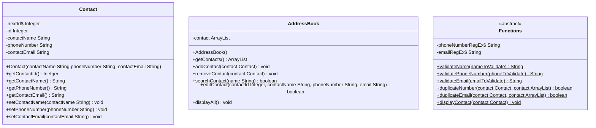

# Domain Models, Class Diagrams and Test Plan
## User Stories and Test Plan

### Requirement 1

As a user, I want the contact to have name, phone number and email address so that I can identify all the contact details.

**Tests:**
  - Test constructor return expected value.
  - Test constructor ID return expected value.
  - Test set name sets name given.
  - Test set email sets email given.
  - Test set phone number sets number given.
  - Test no null or empty name value can be added for a contact.
  - Test no null or empty phone number value can be added for a contact.
  - Test phone number value is in the right format.
  - Test no null or empty email value can be added for a contact.
  - Test email value is in the right format.

### Requirement 2:

As a user, I want to be able to add a contact to the address book, so that I can store all my contacts.

**Tests:**
 - Test add function increments contacts array by one.
 - Test add function adds the contact to the contacts array.

### Requirement 3:

As a user, I want to be able to remove a contact from the address book, so that I can eliminate unnecessary contacts.

**Tests:**
 - Test remove function decrement contacts array by one.
 - Test remove function delete the contact to the contacts array.

### Requirement 4:

As a user, I want to be able to search for a contact by their name, so that I can found the details of the contact when needed.

**Test:**
 - Test search function returns true when name is found.
 - Test search function returns false when name doesn't exist.

### Requirement 5:

As a user, I want to be able to edit the contact's details of an existing contact, so that I can update their details.

**Test:**
 - Test edit function returns true when finds the contact.
 - Test edit function returns false when the contact doesn't exist.
 - Test edit function update the contact details.

### Requirement 6:

As a user, I want to be able to validate that different contacts cannot be added with the same phone number, so that I can avoid duplicates.

**Test:**
 - Test the duplicate number function doesn't allow two contacts with the same phone number.
 - Test the duplicate number function adds the right contact.

### Requirement 7:

As a user, I want to be able to validate that different contacts cannot be added with the same email, so that I can avoid duplicates.

**Test:**
 - Test the duplicate email function doesn't allow two contacts with the same phone number.
 - Test the duplicate email function adds the right contact.

### Requirement 8:

As a user, I want to be able to see the contact searched on the display, so that I can see the contact's details.

**Test:**
    - Test display Contact is been called when search function is used.

### Requirement 9:

As a user, I want to be able to display all contacts in the address book, so that I can see all of them at the same time.

**Test:**
 - Display contact is been tested.
 - No need to test Java.

### Requirement 10:

As a user, I want to be able to use the console interface to interact with the application, so that I can use all the functionality from the address book.

## Class Diagram

